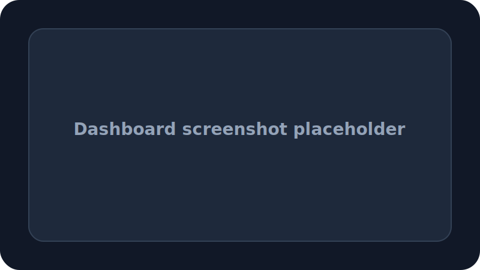
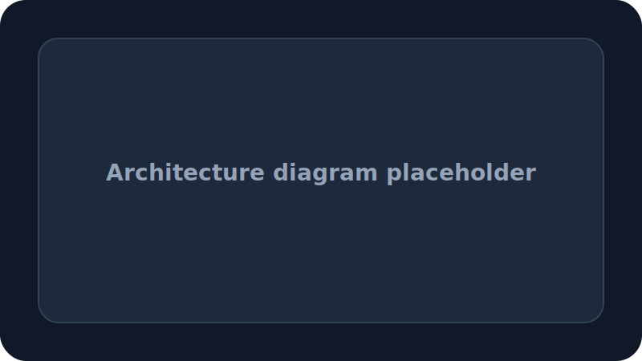

# Quickstart Guide

AI-Agent-Cloud is designed for quick onboarding to a professional open-source AI operations platform.

## 1. Install Prerequisites

- Node.js 20.x
- npm 10.x or newer
- Python 3.12
- Docker and Docker Compose (optional, recommended for local full-stack launch)

## 2. Clone the Repository

```bash
git clone https://github.com/saikirantechy/AI-Agent-Cloud.git
cd AI-Agent-Cloud
```

## 3. Environment Setup

Copy the template environment file:

```bash
cp .env.example .env
```

Open `.env` and configure required values:

```env
OPENAI_API_KEY=your-openai-key
ENVIRONMENT=development
LOG_LEVEL=debug
```

## 4. Backend Startup

Create a virtual environment and install Python dependencies:

```bash
python -m venv .venv
.venv\Scripts\activate
pip install -r backend/requirements.txt
```

Start the backend service:

```bash
cd backend
uvicorn app.main:app --reload --host 0.0.0.0 --port 8000
```

Verify the backend is running:

```bash
curl http://localhost:8000/health
```

## 5. Frontend Startup

Install frontend dependencies and run the dashboard:

```bash
cd frontend
npm install
npm run dev -- --hostname 0.0.0.0 --port 3000
```

Open the dashboard in your browser:

- `http://localhost:3000`

## 6. API Testing

Use cURL or HTTP clients to validate APIs:

```bash
curl http://localhost:8000/agents
curl http://localhost:8000/analytics
curl http://localhost:8000/logs
```

Sample POST request:

```bash
curl -X POST http://localhost:8000/resume/analyze \
  -H "Content-Type: application/json" \
  -d '{"text":"Experienced AI product manager"}'
```

## 7. Troubleshooting

### Backend fails to start
- Confirm `.venv` is activated.
- Check `requirements.txt` for missing packages.
- Review backend logs for import or dependency errors.

### Frontend build issues
- Ensure `npm install` completed successfully.
- Delete `node_modules` and rerun `npm install` if necessary.
- Use `npm run build` to identify any compile errors.

### Docker stack problems
- Confirm Docker Desktop is running.
- Use `docker compose ps` and `docker compose logs -f`.
- Restart containers after changing `.env` values.

## 8. Screenshot Placeholders





## 9. Next Steps

- Review `docs/architecture.md` for design details
- Explore `nexus-agents/` for modular agent patterns
- Open `CONTRIBUTING.md` to learn how to contribute
- Use `.github/workflows/ci.yml` as the CI validation baseline
